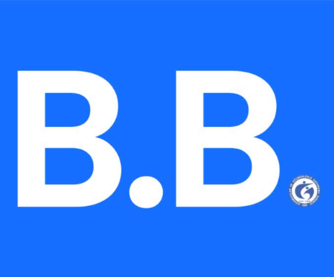

---
# Leave the homepage title empty to use the site title
title: BeBetter
date: 2022-10-24
type: landing

sections:
  - block: markdown
    id: top
    content:
      title: |
        BeBetter

      text: |
         
           
        

            
             
            <h2 style="color:#939397">Empower Your Mental Well-being at Work!</h2>
             
            

                

                    The BeBetter application is specifically designed for the personnel psychological support unit of SGDD-ASAM and for the regular employees. This innovative tool enables the unit to effectively track users' mental well-being, providing valuable insights and support. Users can easily connect with the support unit on demand through the application, fostering a proactive approach to mental health management. With BeBetter, SGDD-ASAM aims to enhance the psychological well-being of its personnel, promoting a healthier and more resilient workforce.
                

            

        

  - block: markdown
    id: gallery
    content:
      title: Gallery
      subtitle: ""
      text: |-
        
    design:
      columns: "1"

  - block: markdown
    id: video
    content:
      title: Video
      subtitle: <iframe width="560" height="315" src="https://www.youtube.com/embed/jA5p3RAxGPU?si=--rcGL0TJTaPm7H8" title="YouTube video player" frameborder="0" allow="accelerometer; autoplay; clipboard-write; encrypted-media; gyroscope; picture-in-picture; web-share" referrerpolicy="strict-origin-when-cross-origin" allowfullscreen></iframe>
    design:
      columns: "1"
  - block: markdown
    id: technologies
    content:
      title: |
        Technologies
      text: |
        

            

                
                
PostgreSQL

            

            

                
                
React Native

            

            

                
                
Expo Go

            

            

                
                
Supabase

            

            

                
                
TypeScript

            

        

         
  - block: people
    id: authors
    content:
      title:
        Meet the Team
        # Choose which groups/teams of users to display.
        #   Edit `user_groups` in each user's profile to add them to one or more of these groups.
      user_groups:
        - Supervisor
        - Software Developers
      sort_by: Params.last_name
      sort_ascending: true
---
